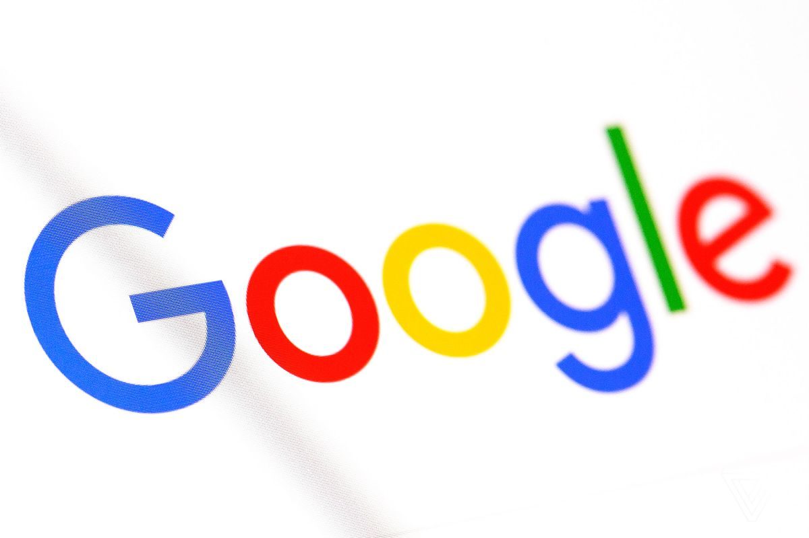

## Challenge 1
#### By: Tomer Negrin
---

[README Link](https://github.com/tnegrin1/DMChallenge1/blob/master/README.md)

[Google Homepage](https://www.google.com/)




```javascript
var s = "Example Code Block"
alert(s)
```

>This is an example of
>a working block quote.

##### Primary Colors:
* Red
- Blue
+ Yellow

##### Winners
1. Gold
1. Silver
4. Bronze

| Place | Medal  |
| ----- | -----: |
| 1     | Gold   |
| 2     | Silver |
| 3     | Bronze |

**Bolded**

*Italicized*

~~Ignore This~~
